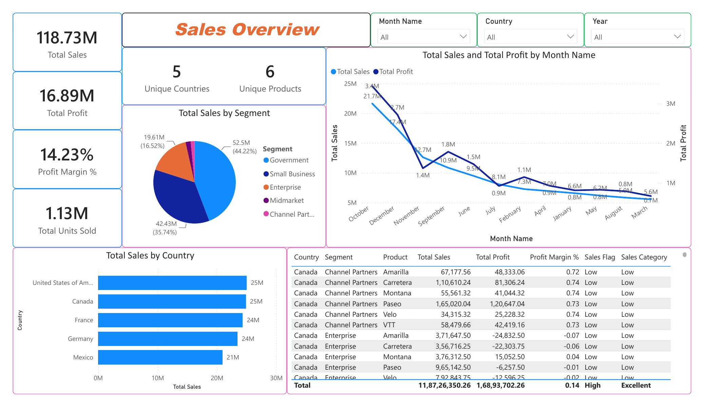
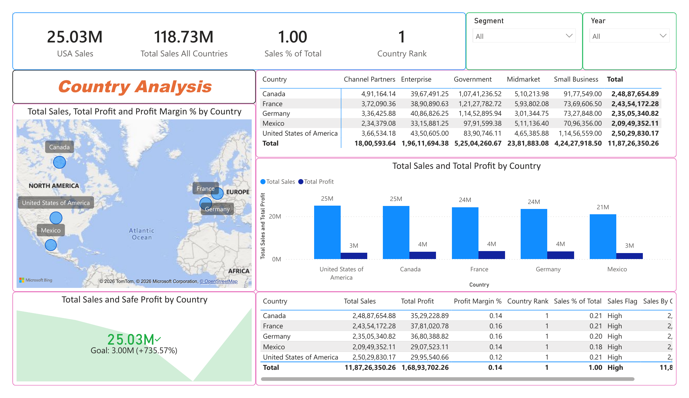
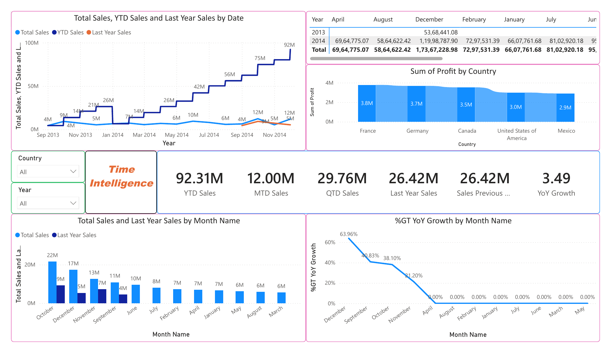
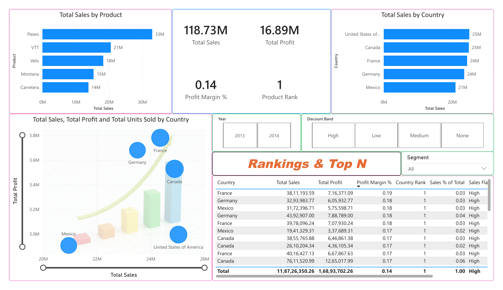

# Power BI Visualization & Technique Showcase

A collection of Power BI visuals and report pages built using Microsoft's public "Financial Sample" dataset, created to demonstrate specific charting, DAX, and report-design techniques rather than to present original business analysis.

## Purpose
This repo is a reference for visual types and DAX patterns I've practiced in Power BI — not a client project or a real-world business dashboard. The dataset is the standard sample bundled with Power BI Desktop, used here deliberately so the focus stays on technique, not data sourcing.

## Techniques demonstrated
- KPI cards with dynamic measures
- Pie / donut charts for segment breakdown
- Combo charts (dual-axis line + column)
- Geographic mapping (Bing/TomTom map visual)
- Ribbon charts for category-over-time comparison
- Goal/gauge-style visuals
- 3D-style scatter/bubble visuals
- Time intelligence measures: YTD, MTD, QTD, YoY growth, prior-period comparison
- Slicers and cross-filtering across report pages
- Rankings and Top-N filtering with RANKX

## Preview

- Dataset is Microsoft's public sample data, not sourced or original.

## Tools
Power BI Desktop, DAX

## Note
GitHub can't render `.pbix` files directly — screenshots above show the report; download the `.pbix` to explore interactively.
